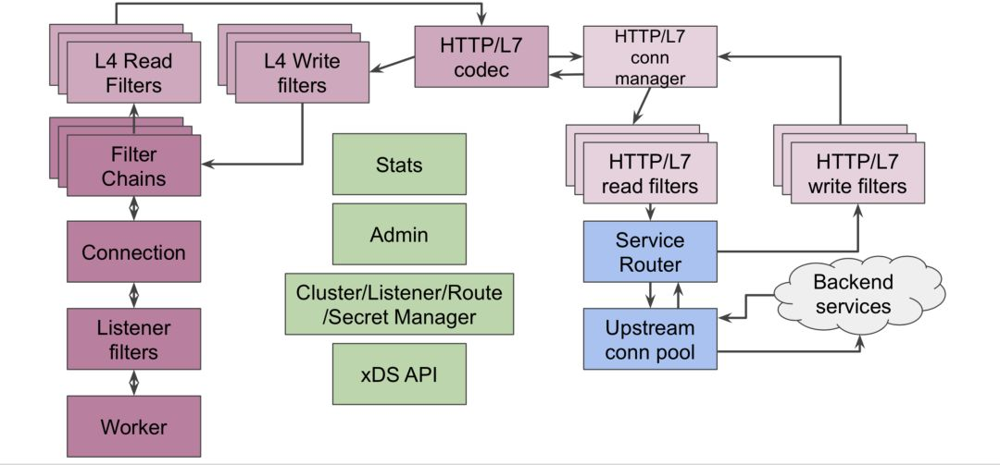
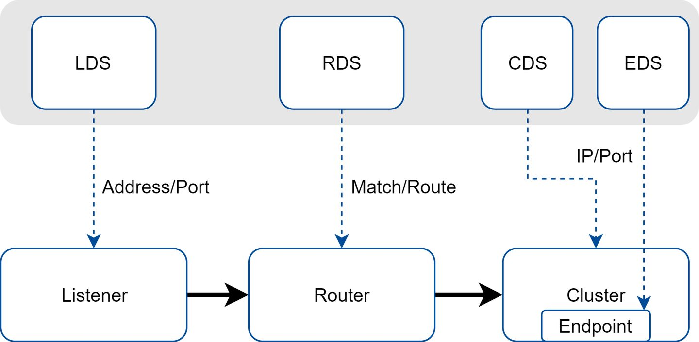

# 学习目标

.jpg)


# 2-1envoy架构




# 2-2核心功能

 Envoy 是专为大型现代 SOA（面向服务架构）架构设计的 L7 代理和通信总线。该项目源于以下理念：

> *网络对应用程序来说应该是透明的。当网络和应用程序出现问题时，应该很容易确定问题的根源。*

实际上，实现上述的目标是非常困难的。为了做到这一点，Envoy 提供了以下高级功能：

**进程外架构：**Envoy 是一个独立进程，设计为伴随每个应用程序服务运行。所有的 Envoy 形成一个透明的通信网格，每个应用程序发送消息到本地主机或从本地主机接收消息，但不知道网络拓扑。在服务间通信的场景下，进程外架构与传统的代码库方式相比，具有两大优点：

- Envoy 可以使用任何应用程序语言。Envoy 部署可以在 Java、C++、Go、PHP、Python 等之间形成一个网格。面向服务架构使用多个应用程序框架和语言的趋势越来越普遍。Envoy 透明地弥合了它们之间的差异。
- 任何做过大型面向服务架构的人都知道，升级部署库可能会非常痛苦。Envoy可以透明地在整个基础架构上快速部署和升级。

**现代 C++11 代码库：**Envoy 是用 C++11 编写的。之所以选择（系统）原生代码是因为我们认为像 Envoy 这样的基础架构组件应该尽可能避让（资源争用）。由于在共享云环境中部署以及使用了非常有生产力但不是特别高效的语言（如 PHP、Python、Ruby、Scala 等），现代应用程序开发人员已经难以找出延迟的原因。原生代码通常提供了优秀的延迟属性，不会对已混乱的系统增加额外负担。与用 C 编写的其他原生代码代理的解决方案不同，C++11 具有出色的开发生产力和性能。

**L3/L4 filter 架构：**Envoy 的核心是一个 L3/L4 网络代理。可插入 [filter](https://www.servicemesher.com/envoy/intro/arch_overview/network_filters.html#arch-overview-network-filters) 链机制允许开发人员编写 filter 来执行不同的 TCP 代理任务并将其插入到主体服务中。现在已有很多用来支持各种任务的 filter，如原始 [TCP 代理](https://www.servicemesher.com/envoy/intro/arch_overview/tcp_proxy.html#arch-overview-tcp-proxy)、[HTTP 代理](https://www.servicemesher.com/envoy/intro/arch_overview/http_connection_management.html#arch-overview-http-conn-man)、[TLS 客户端证书认证](https://www.servicemesher.com/envoy/intro/arch_overview/ssl.html#arch-overview-ssl-auth-filter)等。

**HTTP L7 filter 架构：** HTTP 是现代应用程序体系结构的关键组件，Envoy [支持](https://www.servicemesher.com/envoy/intro/arch_overview/http_filters.html#arch-overview-http-filters)额外的 HTTP L7 filter 层。可以将 HTTP filter 插入执行不同任务的 HTTP 连接管理子系统，例如[缓存](https://www.servicemesher.com/envoy/configuration/http_filters/buffer_filter.html#config-http-filters-buffer)，[速率限制](https://www.servicemesher.com/envoy/intro/arch_overview/global_rate_limiting.html#arch-overview-rate-limit)，[路由/转发](https://www.servicemesher.com/envoy/intro/arch_overview/http_routing.html#arch-overview-http-routing)，嗅探 Amazon 的 [DynamoDB](https://www.servicemesher.com/envoy/intro/arch_overview/dynamo.html#arch-overview-dynamo) 等等。

**顶级 HTTP/2 支持：** 当以 HTTP 模式运行时，Envoy 同时[支持](https://www.servicemesher.com/envoy/intro/arch_overview/http_connection_management.html#arch-overview-http-protocols) HTTP/1.1 和 HTTP/2。Envoy 可以作为 HTTP/1.1 和 HTTP/2 之间的双向透明代理。这意味着它可以桥接 HTTP/1.1 和 HTTP/2 客户端以及目标服务器的任意组合。建议配置所有服务之间的 Envoy 使用 HTTP/2 来创建持久连接的网格，以便可以复用请求和响应。随着协议的逐步淘汰，Envoy 将不支持 SPDY。

**HTTP L7 路由：**当以 HTTP 模式运行时，Envoy 支持一种[路由](https://www.servicemesher.com/envoy/intro/arch_overview/http_routing.html#arch-overview-http-routing)子系统，能够根据路径、权限、内容类型、[运行时](https://www.servicemesher.com/envoy/intro/arch_overview/runtime.html#arch-overview-runtime)及参数值等对请求进行路由和重定向。这项功能在将 Envoy 用作前端/边缘代理时非常有用，同时，在构建服务网格时也会使用此功能。

**gRPC支持：**[gRPC](http://www.grpc.io/) 是一个来自 Google 的 RPC 框架，它使用 HTTP/2 作为底层多路复用传输协议。Envoy [支持](https://www.servicemesher.com/envoy/intro/arch_overview/grpc.html#arch-overview-grpc)被 gRPC 请求和响应的作为路由和负载均衡底层的所有 HTTP/2 功能。这两个系统是非常互补的。

**MongoDB L7 支持：**[MongoDB](https://www.mongodb.com/) 是一种用于现代 Web 应用程序的流行数据库。Envoy [支持](https://www.servicemesher.com/envoy/intro/arch_overview/mongo.html#arch-overview-mongo)对 MongoDB 连接进行 L7 嗅探、统计和日志记录。

**DynamoDB L7 支持**：[DynamoDB](https://aws.amazon.com/dynamodb/) 是亚马逊的托管键/值 NOSQL 数据存储。Envoy [支持](https://www.servicemesher.com/envoy/intro/arch_overview/dynamo.html#arch-overview-dynamo)对 DynamoDB 连接进行 L7 嗅探和统计。

**服务发现和动态配置：** Envoy 可以选择使用[动态配置 API](https://www.servicemesher.com/envoy/intro/arch_overview/dynamic_configuration.html#arch-overview-dynamic-config) 的分层集合实现集中管理。这些层为Envoy 提供了以下内容的动态更新：后端集群内的主机、后端集群本身、HTTP 路由、监听套接字和加密材料。对于更简单的部署，可以通过[DNS 解析](https://www.servicemesher.com/envoy/intro/arch_overview/service_discovery.html#arch-overview-service-discovery)（甚至[完全跳过](https://www.servicemesher.com/envoy/intro/arch_overview/service_discovery.html#arch-overview-service-discovery-types-sds)）发现后端主机，静态配置文件将替代更深的层。

**健康检查：**[推荐](https://www.servicemesher.com/envoy/intro/arch_overview/service_discovery.html#arch-overview-service-discovery-eventually-consistent)使用将服务发现视为最终一致的过程的方式来建立 Envoy 网格。Envoy 包含了一个[健康检查](https://www.servicemesher.com/envoy/intro/arch_overview/health_checking.html#arch-overview-health-checking)子系统，可以选择对上游服务集群执行主动健康检查。然后，Envoy 联合使用服务发现和健康检查信息来确定健康的负载均衡目标。Envoy 还通过[异常检测](https://www.servicemesher.com/envoy/intro/arch_overview/outlier.html#arch-overview-outlier-detection)子系统支持被动健康检查。

**高级负载均衡：**[负载均衡](https://www.servicemesher.com/envoy/intro/arch_overview/load_balancing.html#arch-overview-load-balancing)是分布式系统中不同组件之间的一个复杂问题。由于 Envoy 是一个独立代理而不是库，因此可以独立实现高级负载均衡以供任何应用程序访问。目前，Envoy 支持[自动重试](https://www.servicemesher.com/envoy/intro/arch_overview/http_routing.html#arch-overview-http-routing-retry) 、[熔断](https://www.servicemesher.com/envoy/intro/arch_overview/circuit_breaking.html#arch-overview-circuit-break)、通过外部速率限制服务的[全局速率限制](https://www.servicemesher.com/envoy/intro/arch_overview/global_rate_limiting.html#arch-overview-rate-limit)、[请求映射](https://www.envoyproxy.io/docs/envoy/latest/api-v1/route_config/route#config-http-conn-man-route-table-route-shadow)和[异常点检测](https://www.servicemesher.com/envoy/intro/arch_overview/outlier.html#arch-overview-outlier-detection)。未来还计划支持请求竞争。

**前端/边缘代理支持：**尽管 Envoy 主要设计用来作为一个服务间的通信系统，但在系统边缘使用相同的软件也是大有好处的（可观察性、管理、相同的服务发现和负载均衡算法等）。Envoy 包含足够多的功能，使其可作为大多数现代 Web 应用程序的边缘代理。这包括 [TLS](https://www.servicemesher.com/envoy/intro/arch_overview/ssl.html#arch-overview-ssl) 终止、HTTP/1.1 和 HTTP/2 [支持](https://www.servicemesher.com/envoy/intro/arch_overview/http_connection_management.html#arch-overview-http-protocols)，以及 HTTP L7 [路由](https://www.servicemesher.com/envoy/intro/arch_overview/http_routing.html#arch-overview-http-routing)。

**最佳的可观察性：** 如上所述，Envoy 的主要目标是使网络透明。但是，问题在网络层面和应用层面都可能会出现。Envoy 包含对所有子系统强大的[统计](https://www.servicemesher.com/envoy/intro/arch_overview/statistics.html#arch-overview-statistics)功能支持。目前支持 [statsd](https://github.com/etsy/statsd)（和兼容的提供程序）作为统计信息接收器，但是插入不同的接收器并不困难。统计信息也可以通过[管理](https://www.servicemesher.com/envoy/operations/admin.html#operations-admin-interface)端口查看。Envoy 还通过第三方提供商支持分布式[追踪](https://www.servicemesher.com/envoy/intro/arch_overview/tracing.html#arch-overview-tracing)。

# 线程模型

 Envoy 使用单进程 - 多线程的架构模型。一个 *master* 线程管理各种琐碎的任务，而一些 *worker* 线程则负责执行监听、过滤和转发。当监听器接收到一个连接请求时，该连接将其生命周期绑定到一个单独的 *worker* 线程。这使得 Envoy 主要使用大量单线程（ embarrassingly parallel ）处理工作，并且只有少量的复杂代码用于实现 *worker* 线程之间的协调工作。通常情况下，Envoy 实现了100%的非阻塞。对于大多数工作负载，我们建议将 *worker* 线程数配置为物理机器的线程数。 

# 2-3envoy基本概念

**Host**：能够进行网络通信的实体（在手机或服务器等上的应用程序）。在 Envoy 中主机是指逻辑网络应用程序。只要每台主机都可以独立寻址，一块物理硬件上就运行多个主机。

**Downstream**：下游（downstream）主机连接到 Envoy，发送请求并或获得响应。

**Upstream**：上游（upstream）主机获取来自 Envoy 的链接请求和响应。

**Cluster**: 集群（cluster）是 Envoy 连接到的一组逻辑上相似的上游主机。Envoy 通过[服务发现]发现集群中的成员。Envoy 可以通过[主动运行状况检查]来确定集群成员的健康状况。Envoy 如何将请求路由到集群成员由[负载均衡策略]确定。

**Mesh**：一组互相协调以提供一致网络拓扑的主机。Envoy mesh 是指一组 Envoy 代理，它们构成了由多种不同服务和应用程序平台组成的分布式系统的消息传递基础。

**运行时配置**：与 Envoy 一起部署的带外实时配置系统。可以在无需重启 Envoy 或 更改 Envoy 主配置的情况下，通过更改设置来影响操作。

**Listener**: 侦听器（listener）是可以由下游客户端连接的命名网络位置（例如，端口、unix域套接字等）。Envoy 公开一个或多个下游主机连接的侦听器。一般是每台主机运行一个 Envoy，使用单进程运行，但是每个进程中可以启动任意数量的 Listener（监听器），每个监听器都独立配置一定数量的（L3/L4）网络过滤器。Listenter 也可以通过 Listener Discovery Service（**LDS**）动态获取。

**Listener filter**：Listener 使用 listener filter（监听器过滤器）来操作链接的元数据。它的作用是在不更改 Envoy 的核心功能的情况下添加更多的集成功能。Listener filter 的 API 相对简单，因为这些过滤器最终是在新接受的套接字上运行。在链中可以互相衔接以支持更复杂的场景，例如调用速率限制。Envoy 已经包含了多个监听器过滤器。

**Http Route Table**：HTTP 的路由规则，例如请求的域名，Path 符合什么规则，转发给哪个 Cluster。

**Health checking**：健康检查会与服务发现配合使用。但是，即使使用其他服务发现方式，也有相应需要进行主动健康检查的情况。

# 2-4xds

xds 是lds,rds,cds,eds,sds的总称,即发现服务,也就是他后2个字母ds是discovery service

## lds

l即envoy的监听端口,lds用于动态发现envoy需要监听哪些端口

## rds

r即路由,rds用于发现路由配置

## cds

c即cluster,cds用于动态发现cluster上游cluster信息

## eds

e即endpoint,eds用于动态发现服务端点

## sds

s即秘钥,sds用于动态发现tls证书

##  xDS以及各个资源之间的关系 


# 

# filter种类

## 2-5listener filter

```
envoy.filters.listener.http_inspector
http_inspector用来应用协议是不是http，如果是http它会继续检测是http1.1还是http2，这个可以用来选择filterChain，通过判断filterChainMatch的application_protocols


envoy.filters.listener.original_dst
Original Destination 用来读取 socket 的配置项 SO_ORIGINAL_DST，在使用 透明代理模式 时用到，在 envoy 中，用该 filter 获取报文的原始目地地址：


envoy.filters.listener.original_src
Original Source 用于透明代理，让 uptream 看到的是请求端的 IP，双方均感知不到 envoy 的存在。

Original Source 有点类似于 lvs 的 DR 模式 ，假设 downstream 的 IP 是 10.1.2.3，envoy 的 IP 是 10.2.2.3。envoy 将报文转发给 upstream 时复用 downstream 的源 IP，upstream 看到的源 IP 是 downstream 的 IP 10.1.2.3，不是 envoy 的 IP 10.2.2.3。

与 lvs 的 DR 模式 区别是，在 lvs 中，upsteram 是直接将回应包发送给 downstream，而 envoy 的文档中强调，必须通过配置网络环境，让 uptream 的回应包发送到 envoy ，再由 envoy 转发。

下面是一个使用示例，用到了两个 filter：第一个 filter 是 envoy.listener.proxy_protocol，用途是从代理协议中解析出真实的源 IP，详情见下一节； 第二个 filter 是 envoy.listener.original_src ，作用是透传源 IP。

listeners:
- address:
    socket_address:
      address: 0.0.0.0
      port_value: 8888
  listener_filters:
    - name: envoy.filters.listener.proxy_protocol
    - name: envoy.filters.listener.original_src
      config:
        mark: 123
mark 123 设置了被透传的报文需要打上的标记，当 upstream 和 envoy 位于同一台机器上时，将打了标记的报文转发到本地:


envoy.filters.listener.proxy_protocol
Proxy Protocol 解析代理协议，用该 filter 可以解析出真实的源 IP，已知支持 HAProxy Proxy Protocol


envoy.filters.listener.tls_inspector
TLS Inspector 用来判断是否使用 TLS 协议，如果是 TLS 协议，解析出 Server Name、Negotiation 信息，解析出来的信息用于 FilterChain 的匹配。

envoy.filters.udp_listener.dns_filter
用来dns ip地址查询，可以是静态地址，或外部dns服务器。
Example Configuration
listener_filters:
- name: envoy.filters.udp.dns_filter
  typed_config:
    "@type": "type.googleapis.com/envoy.extensions.filters.udp.dns_filter.v3alpha.DnsFilterConfig"
    stat_prefix: "dns_filter_prefix"
    client_config:
      resolution_timeout: 5s
      dns_resolution_config:
        dns_resolver_options:
          use_tcp_for_dns_lookups: false
          no_default_search_domain: false
        resolvers:
        - socket_address:
            address: "8.8.8.8"
            port_value: 53
        - socket_address:
            address: "8.8.4.4"
            port_value: 53
      max_pending_lookups: 256
    server_config:
      inline_dns_table:
        virtual_domains:
          - name: "www.domain1.com"
            endpoint:
              address_list:
                address:
                - 10.0.0.1
                - 10.0.0.2
          - name: "www.domain2.com"
            endpoint:
              address_list:
                address:
                  - 2001:8a:c1::2800:7
          - name: "www.domain3.com"
            endpoint:
              address_list:
                address:
                - 10.0.3.1
          - name: "www.domain4.com"
            endpoint:
              cluster_name: cluster_0
          - name: "voip.domain5.com"
            endpoint:
              service_list:
                services:
                  - service_name: "sip"
                    protocol: { number: 6 }
                    ttl: 86400s
                    targets:
                    - host_name: "primary.voip.domain5.com"
                      priority: 10
                      weight: 30
                      port: 5060
                    - host_name: "secondary.voip.domain5.com"
                      priority: 10
                      weight: 20
                      port: 5060
                    - host_name: "backup.voip.domain5.com"
                      priority: 10
                      weight: 10
                      port: 5060
                      

envoy.filters.udp_listener.udp_proxy
这个过滤器可用来在客户端和服务器之间启用一个非透明代理。 use_original_src_ip这个参数可以使非透明代理改为透明得。但是这样只forward ip到上游端点。
The following example configuration will cause Envoy to listen on UDP port 1234 and proxy to a UDP server listening on port 1235, allowing 9000 byte packets in both directions (i.e., either jumbo frames or fragmented IP packets).

admin:
  address:
    socket_address:
      protocol: TCP
      address: 127.0.0.1
      port_value: 9901
static_resources:
  listeners:
  - name: listener_0
    reuse_port: true
    address:
      socket_address:
        protocol: UDP
        address: 127.0.0.1
        port_value: 1234
    udp_listener_config:
      downstream_socket_config:
        max_rx_datagram_size: 9000
    listener_filters:
    - name: envoy.filters.udp_listener.udp_proxy
      typed_config:
        '@type': type.googleapis.com/envoy.extensions.filters.udp.udp_proxy.v3.UdpProxyConfig
        stat_prefix: service
        cluster: service_udp
        upstream_socket_config:
          max_rx_datagram_size: 9000
  clusters:
  - name: service_udp
    type: STATIC
    lb_policy: ROUND_ROBIN
    load_assignment:
      cluster_name: service_udp
      endpoints:
      - lb_endpoints:
        - endpoint:
            address:
              socket_address:
                address: 127.0.0.1
                port_value: 1235

```

## 2-6network filter

```
envoy.filters.network.client_ssl_auth
Client TLS authentication 验证 client 端的证书，它会以配置的频率调用 GET /v1/certs/list/approved 获取最新的有效证书

envoy.filters.network.direct_response
用于直接响应客户端，它可以用做终结性过滤器，用于收集阻塞流量的遥测数据。

envoy.filters.network.dubbo_proxy
Dubbo proxy 解析 dubbo client 和 service 之间的 rpc通信。Dubbo proxy 有自己专用的 Dubbo filters。

envoy.filters.network.echo
Echo 将收到的数据原样返回给客户端。

envoy.filters.network.ext_authz
External Authorization 通过外部的认证服务判断当前请求是否获得授权，如果没有授权，关闭连接。

envoy.filters.network.http_connection_manager
HTTP connection manager 是专门处理 http 协议的 network filter，因为 http 最经常使用的协议，对代理功能需求也非常多样， HTTP connection manager 本身是一个比较复杂的 network filter

envoy.filters.network.kafka_broker
用于解析kafka协议

envoy.filters.network.local_ratelimit
4层本地限流

envoy.filters.network.mongo_proxy
Mongo proxy 能够解析 mongo 通信，记录 mongo 日志、统计、注入错误等。

envoy.filters.network.mysql_proxy
MySQL proxy 能够解析 mysql 的通信协议，需要和 [TCP proxy][] 一起使用：

envoy.filters.network.postgres_proxy
用于解析postgres协议

envoy.filters.network.ratelimit
Rate limit 提供全局限速功能（需要连接外部的限速服务），可以限制 tcp 连接速率和 http 请求速率。为了避免每个连接、或者每个请求都查询限速服务，可以设置限速服务的查询占比：

envoy.filters.network.rbac
Role Based Access Control (RBAC) Network Filter 提供了访问控制的能力。

envoy.filters.network.redis_proxy
Redis proxy 能够解析 redis 协议，使 envoy 成为 redis 代理，可以将不同的 redis command 代理到不同 redis cluster。

envoy.filters.network.rocketmq_proxy
用于解析rockepmq协议

envoy.filters.network.sni_cluster
在tls链接中通过sni字段设置上游的集群名称

envoy.filters.network.sni_dynamic_forward_proxy
用于支持 HTTP dynamic forward proxy

envoy.filters.network.tcp_proxy
TCP proxy 是四层 tcp 代理，管理 downstream client 与 upstream cluster 之间的 tcp 连接，保证连接数不超过 upstream cluster 的上限。

envoy.filters.network.thrift_proxy
Thrift proxy 能够解析 thrift 协议。Thrift proxy 有自己专用的 Thrift filters。

envoy.filters.network.wasm
用于支持 Wasm 插件
name: envoy.filters.network.wasm
typed_config:
  "@type": type.googleapis.com/envoy.extensions.filters.network.wasm.v3.Wasm
  config:

      name: "my_plugin"
      vm_config:
        runtime: "envoy.wasm.runtime.v8"
        code:
          local:
            filename: "/etc/envoy_filter_http_wasm_example.wasm"
        allow_precompiled: true

envoy.filters.network.zookeeper_proxy
ZooKeeper proxy 能够解析 zookeeper 协议。

```

## 2-7http filter

```
envoy.filters.http.adaptive_concurrency
动态适配在一个集群里的所有主机的并发数量
name: envoy.filters.http.adaptive_concurrency
typed_config:
  "@type": type.googleapis.com/envoy.extensions.filters.http.adaptive_concurrency.v3.AdaptiveConcurrency
  gradient_controller_config:
    sample_aggregate_percentile:
      value: 90
    concurrency_limit_params:
      concurrency_update_interval: 0.1s
    min_rtt_calc_params:
      jitter:
        value: 10
      interval: 60s
      request_count: 50
  enabled:
    default_value: true
    runtime_key: "adaptive_concurrency.enabled"

envoy.filters.http.admission_control
在一个窗口时间内，根据前面请求的成功率，一定可能性拒绝请求。
name: envoy.filters.http.admission_control
typed_config:
  "@type": type.googleapis.com/envoy.extensions.filters.http.admission_control.v3alpha.AdmissionControl
  enabled:
    default_value: true
    runtime_key: "admission_control.enabled"
  sampling_window: 120s
  sr_threshold:
    default_value: 95.0
    runtime_key: "admission_control.sr_threshold"
  aggression:
    default_value: 1.5
    runtime_key: "admission_control.aggression"
  rps_threshold:
    default_value: 5
    runtime_key: "admission_control.rps_threshold"
  max_rejection_probability:
    default_value: 80.0
    runtime_key: "admission_control.max_rejection_probability"
  success_criteria:
    http_criteria:
      http_success_status:
        - start: 100
          end:   400
        - start: 404
          end:   404
    grpc_criteria:
      grpc_success_status:
        - 0
        - 1

envoy.filters.http.aws_lambda
用于从一个标准请求中触发一个AWS Lambda函数。
http_filters:
- name: envoy.filters.http.aws_lambda
  typed_config:
    "@type": type.googleapis.com/envoy.extensions.filters.http.aws_lambda.v3.Config
    arn: "arn:aws:lambda:us-west-2:987654321:function:hello_envoy"
    payload_passthrough: true
  
weighted_clusters:
clusters:
- name: lambda_egress_gateway
  weight: 42
  typed_per_filter_config:
    envoy.filters.http.aws_lambda:
      "@type": type.googleapis.com/envoy.extensions.filters.http.aws_lambda.v3.PerRouteConfig
      invoke_config:
        arn: "arn:aws:lambda:us-west-2:987654321:function:hello_envoy"
        payload_passthrough: false
        

envoy.filters.http.aws_request_signing
用于访问AWS 认证服务，使用AWS Credential Provider获取secret用来产生请求头。
name: envoy.filters.http.aws_request_signing
typed_config:
  "@type": type.googleapis.com/envoy.extensions.filters.http.aws_request_signing.v3.AwsRequestSigning
  service_name: s3
  region: us-west-2
  use_unsigned_payload: true

envoy.filters.http.buffer
用于停止过滤器迭代，等待一个完全完成的请求，用于在部分请求或高延迟的时候保护应用。


envoy.filters.http.cache
用于缓存响应

envoy.filters.http.cache.simple_http_cache
用于缓存http响应

envoy.filters.http.cdn_loop
用于交叉cdn循环检测，执行两个动作：检测在cdn循环头里一个cdn标识符出现的次数，如果检测成功将cdn标识符放到cdn-loop头里面然后进入下一个过滤器，如果检测失败返回错误。

envoy.filters.http.composite
根据匹配规则代理过滤器动作，这么做的目的是根据请求得到不同的过滤器配置
admin:
  access_log_path: /tmp/admin_access.log
  address:
    socket_address: {address: 0.0.0.0, port_value: 9901}

static_resources:
  listeners:
  - name: listener1
    address:
      socket_address: {address: 0.0.0.0, port_value: 51051}
    filter_chains:
    - filters:
      - name: envoy.filters.network.http_connection_manager
        typed_config:
          "@type": type.googleapis.com/envoy.extensions.filters.network.http_connection_manager.v3.HttpConnectionManager
          stat_prefix: grpc_json
          codec_type: AUTO
          route_config:
            name: local_route
            virtual_hosts:
            - name: local_service
              domains: ["*"]
              routes:
              # NOTE: by default, matching happens based on the gRPC route, and not on the incoming request path.
              # Reference: https://www.envoyproxy.io/docs/envoy/latest/configuration/http_filters/grpc_json_transcoder_filter#route-configs-for-transcoded-requests
              - match: {prefix: "/helloworld.Greeter"}
                route: {cluster: grpc, timeout: 60s}
          http_filters:
          - name: composite
            typed_config:
              "@type": type.googleapis.com/envoy.extensions.common.matching.v3.ExtensionWithMatcher
              extension_config:
                name: composite
                typed_config:
                  "@type": type.googleapis.com/envoy.extensions.filters.http.composite.v3.Composite
              matcher:
                matcher_tree:
                  input:
                    name: request-headers
                    typed_config:
                      "@type": type.googleapis.com/envoy.type.matcher.v3.HttpRequestHeaderMatchInput
                      header_name: x-fault-category
                  exact_match_map:
                    map:
                      "huge fault":  # inject 10s latency into all requests
                        action:
                          name: composite-action
                          typed_config:
                            "@type": type.googleapis.com/envoy.extensions.filters.http.composite.v3.ExecuteFilterAction
                            typed_config:
                              name: http-fault
                              typed_config:
                                "@type": type.googleapis.com/envoy.extensions.filters.http.fault.v3.HTTPFault
                                delay:
                                  fixed_delay: 10s
                                  percentage:
                                    numerator: 100
                                    denominator: HUNDRED
                      "tiny fault":  # inject 1s latency into all requests
                        action:
                          name: composite-action
                          typed_config:
                            "@type": type.googleapis.com/envoy.extensions.filters.http.composite.v3.ExecuteFilterAction
                            typed_config:
                              name: http-fault
                              typed_config:
                                "@type": type.googleapis.com/envoy.extensions.filters.http.fault.v3.HTTPFault
                                delay:
                                  fixed_delay: 1s
                                  percentage:
                                    numerator: 100
                                    denominator: HUNDRED
          - name: envoy.filters.http.router

  clusters:
  - name: grpc
    type: LOGICAL_DNS
    lb_policy: ROUND_ROBIN
    dns_lookup_family: V4_ONLY
    typed_extension_protocol_options:
      envoy.extensions.upstreams.http.v3.HttpProtocolOptions:
        "@type": type.googleapis.com/envoy.extensions.upstreams.http.v3.HttpProtocolOptions
        explicit_http_config:
          http2_protocol_options: {}
    load_assignment:
      cluster_name: grpc
      endpoints:
      - lb_endpoints:
        - endpoint:
            address:
              socket_address:
                address: 127.0.0.1
                port_value: 50051

layered_runtime:
  layers:
  - name: static-layer
    static_layer:
      envoy:
        reloadable_features:
          experimental_matching_api: true

envoy.filters.http.compressor
压缩过滤器，根据请求和响应头条件判断是否需要压缩。
http_filters:
- name: envoy.filters.http.compressor
  typed_config:
    "@type": type.googleapis.com/envoy.extensions.filters.http.compressor.v3.Compressor
    response_direction_config:
      common_config:
        min_content_length: 100
        content_type:
          - text/html
          - application/json
      disable_on_etag_header: true
    request_direction_config:
      common_config:
        enabled:
          default_value: false
          runtime_key: request_compressor_enabled
    compressor_library:
      name: text_optimized
      typed_config:
        "@type": type.googleapis.com/envoy.extensions.compression.gzip.compressor.v3.Gzip
        memory_level: 3
        window_bits: 10
        compression_level: best_compression
        compression_strategy: default_strategy

envoy.filters.http.cors
跨站资源共享过滤器器，用来判断和处理是否跨站请求。

envoy.filters.http.csrf
跨站请求伪造过滤器，用于防止跨站请求伪造攻击。

envoy.filters.http.decompressor
解压过滤器，用于双向解压数据。
http_filters:
# This filter is only enabled for requests.
- name: envoy.filters.http.decompressor
  typed_config:
    "@type": type.googleapis.com/envoy.extensions.filters.http.decompressor.v3.Decompressor
    decompressor_library:
      name: small
      typed_config:
        "@type": "type.googleapis.com/envoy.extensions.compression.gzip.decompressor.v3.Gzip"
        window_bits: 9
        chunk_size: 8192
    response_direction_config:
      common_config:
        enabled:
          default_value: false
          runtime_key: response_decompressor_enabled
# This filter is only enabled for responses.
- name: envoy.filters.http.decompressor
  typed_config:
    "@type": type.googleapis.com/envoy.extensions.filters.http.decompressor.v3.Decompressor
    decompressor_library:
      name: large
      typed_config:
        "@type": "type.googleapis.com/envoy.extensions.compression.gzip.decompressor.v3.Gzip"
        window_bits: 12
        chunk_size: 16384
    request_direction_config:
      common_config:
        enabled:
          default_value: false
          runtime_key: request_decompressor_enabled

envoy.filters.http.dynamic_forward_proxy
动态forward代理

envoy.filters.http.dynamo
用于支持DynamoDB数据库

envoy.filters.http.ext_authz
外部认证过滤器，调用外部的grpc或http判断请求是否有权限。
http_filters:
  - name: envoy.filters.http.ext_authz
    typed_config:
      "@type": type.googleapis.com/envoy.extensions.filters.http.ext_authz.v3.ExtAuthz
      grpc_service:
        envoy_grpc:
          cluster_name: ext-authz
      with_request_body:
        max_request_bytes: 1024
        allow_partial_message: true
        pack_as_bytes: true
        
route_config:
  name: local_route
  virtual_hosts:
  - name: local_service
    domains: ["*"]
    typed_per_filter_config:
      envoy.filters.http.ext_authz:
        "@type": type.googleapis.com/envoy.extensions.filters.http.ext_authz.v3.ExtAuthzPerRoute
        check_settings:
          context_extensions:
            virtual_host: local_service
    routes:
    - match: { prefix: "/static" }
      route: { cluster: some_service }
      typed_per_filter_config:
        envoy.filters.http.ext_authz:
          "@type": type.googleapis.com/envoy.extensions.filters.http.ext_authz.v3.ExtAuthzPerRoute
          disabled: true
    - match: { prefix: "/" }
      route: { cluster: some_service }

envoy.filters.http.ext_proc
外部处理服务过滤器。

envoy.filters.http.fault
故障注入过滤器，包括超时和终止注入。

envoy.filters.http.grpc_http1_bridge
一个简单过滤器启用http1.1客户端桥接grpc服务器。

envoy.filters.http.grpc_http1_reverse_bridge
桥接grpc客户端和http1.1服务器
admin:
  address:
    socket_address:
      address: 0.0.0.0
      port_value: 9901
static_resources:
  listeners:
  - name: listener_0
    address:
      socket_address:
        address: 0.0.0.0
        port_value: 80
    filter_chains:
    - filters:
      - name: envoy.filters.network.http_connection_manager
        typed_config:
          "@type": type.googleapis.com/envoy.extensions.filters.network.http_connection_manager.v3.HttpConnectionManager
          access_log:
          - name: envoy.access_loggers.stdout
            typed_config:
              "@type": type.googleapis.com/envoy.extensions.access_loggers.stream.v3.StdoutAccessLog
          stat_prefix: ingress_http
          route_config:
            name: local_route
            virtual_hosts:
            - name: local_service
              domains: ["*"]
              routes:
              - match:
                  prefix: "/route-with-filter-disabled"
                route:
                  host_rewrite_literal: localhost
                  cluster: grpc
                  timeout: 5.00s
                # per_filter_config disables the filter for this route
                typed_per_filter_config:
                  envoy.filters.http.grpc_http1_reverse_bridge:
                    "@type": type.googleapis.com/envoy.extensions.filters.http.grpc_http1_reverse_bridge.v3.FilterConfigPerRoute
                    disabled: true
              - match:
                  prefix: "/route-with-filter-enabled"
                route:
                  host_rewrite_literal: localhost
                  cluster: other
                  timeout: 5.00s
          http_filters:
          - name: envoy.filters.http.grpc_http1_reverse_bridge
            typed_config:
              "@type": type.googleapis.com/envoy.extensions.filters.http.grpc_http1_reverse_bridge.v3.FilterConfig
              content_type: application/grpc+proto
              withhold_grpc_frames: true
          - name: envoy.filters.http.router
  clusters:
  - name: other
    type: LOGICAL_DNS
    dns_lookup_family: V4_ONLY
    lb_policy: ROUND_ROBIN
    load_assignment:
      cluster_name: some_service
      endpoints:
      - lb_endpoints:
        - endpoint:
            address:
              socket_address:
                address: localhost
                port_value: 4630
  - name: grpc
    type: STRICT_DNS
    lb_policy: ROUND_ROBIN
    typed_extension_protocol_options:
      envoy.extensions.upstreams.http.v3.HttpProtocolOptions:
        "@type": type.googleapis.com/envoy.extensions.upstreams.http.v3.HttpProtocolOptions
        explicit_http_config:
          http2_protocol_options: {}
    load_assignment:
      cluster_name: grpc
      endpoints:
      - lb_endpoints:
        - endpoint:
            address:
              socket_address:
                address: localhost
                port_value: 10005

envoy.filters.http.grpc_json_transcoder
json请求转换成grpc代理过滤器。
static_resources:
  listeners:
  - name: listener1
    address:
      socket_address: {address: 0.0.0.0, port_value: 51051}
    filter_chains:
    - filters:
      - name: envoy.filters.network.http_connection_manager
        typed_config:
          "@type": type.googleapis.com/envoy.extensions.filters.network.http_connection_manager.v3.HttpConnectionManager
          stat_prefix: grpc_json
          codec_type: AUTO
          route_config:
            name: local_route
            virtual_hosts:
            - name: local_service
              domains: ["*"]
              routes:
              # NOTE: by default, matching happens based on the gRPC route, and not on the incoming request path.
              # Reference: https://www.envoyproxy.io/docs/envoy/latest/configuration/http_filters/grpc_json_transcoder_filter#route-configs-for-transcoded-requests
              - match: {prefix: "/helloworld.Greeter"}
                route: {cluster: grpc, timeout: 60s}
          http_filters:
          - name: envoy.filters.http.grpc_json_transcoder
            typed_config:
              "@type": type.googleapis.com/envoy.extensions.filters.http.grpc_json_transcoder.v3.GrpcJsonTranscoder
              proto_descriptor: "protos/helloworld.pb"
              services: ["helloworld.Greeter"]
              print_options:
                add_whitespace: true
                always_print_primitive_fields: true
                always_print_enums_as_ints: false
                preserve_proto_field_names: false
          - name: envoy.filters.http.router

  clusters:
  - name: grpc
    type: LOGICAL_DNS
    lb_policy: ROUND_ROBIN
    dns_lookup_family: V4_ONLY
    typed_extension_protocol_options:
      envoy.extensions.upstreams.http.v3.HttpProtocolOptions:
        "@type": type.googleapis.com/envoy.extensions.upstreams.http.v3.HttpProtocolOptions
        explicit_http_config:
          http2_protocol_options: {}
    load_assignment:
      cluster_name: grpc
      endpoints:
      - lb_endpoints:
        - endpoint:
            address:
              socket_address:
                # WARNING: "docker.for.mac.localhost" has been deprecated from Docker v18.03.0.
                # If you're running an older version of Docker, please use "docker.for.mac.localhost" instead.
                # Reference: https://docs.docker.com/docker-for-mac/release-notes/#docker-community-edition-18030-ce-mac59-2018-03-26
                address: host.docker.internal
                port_value: 50051
                

envoy.filters.http.grpc_stats
grpc统计遥测过滤器

envoy.filters.http.grpc_web
桥接grpc_web客户端和grpc服务端。

envoy.filters.http.gzip
gzip压缩过滤器

envoy.filters.http.header_to_metadata
根据配置的规则，判断cookie或头是否存在触发规则，添加元数据
http_filters:
  - name: envoy.filters.http.header_to_metadata
    typed_config:
      "@type": type.googleapis.com/envoy.extensions.filters.http.header_to_metadata.v3.Config
      request_rules:
        - header: x-version
          on_header_present:
            metadata_namespace: envoy.lb
            key: version
            type: STRING
          on_header_missing:
            metadata_namespace: envoy.lb
            key: default
            value: 'true'
            type: STRING
          remove: false
http_filters:
  - name: envoy.filters.http.header_to_metadata
    typed_config:
      "@type": type.googleapis.com/envoy.extensions.filters.http.header_to_metadata.v3.Config
      request_rules:
        - header: ":path"
          on_header_present:
            metadata_namespace: envoy.lb
            key: cluster
            regex_value_rewrite:
              pattern:
                google_re2: {}
                regex: "^/(cluster[\\d\\w-]+)/?.*$"
              substitution: "\\1"
route_config:
  name: local_route
  virtual_hosts:
  - name: local_service
    domains: ["*"]
    routes:
    - match: { prefix: "/version-to-metadata" }
      route: { cluster: service }
      typed_per_filter_config:
        envoy.filters.http.header_to_metadata:
          "@type": type.googleapis.com/envoy.extensions.filters.http.header_to_metadata.v3.Config
          request_rules:
            - header: x-version
              on_header_present:
                metadata_namespace: envoy.lb
                key: version
                type: STRING
              remove: false
    - match: { prefix: "/" }
      route: { cluster: some_service }

envoy.filters.http.health_check
健康检查过滤器

envoy.filters.http.ip_tagging
从来自x-forwarded-for的可信ip地址设置x-envoy-ip-tags头。

envoy.filters.http.jwt_authn
jwt认证过滤器。
providers:
  jwt_provider1:
    issuer: https://example.com
    audiences:
      audience1
    local_jwks:
      inline_string: PUBLIC-KEY
rules:
- match:
    prefix: /health
- match:
    prefix: /api
  requires:
    provider_and_audiences:
      provider_name: jwt_provider1
      audiences:
        api_audience
- match:
    prefix: /
  requires:
    provider_name: jwt_provider1
    
providers:
  provider1:
    issuer: https://provider1.com
    local_jwks:
      inline_string: PUBLIC-KEY
  provider2:
    issuer: https://provider2.com
    local_jwks:
      inline_string: PUBLIC-KEY
rules:
- match:
    prefix: /any
  requires:
    requires_any:
      requirements:
      - provider_name: provider1
      - provider_name: provider2
- match:
    prefix: /all
  requires:
    requires_all:
      requirements:
      - provider_name: provider1
      - provider_name: provider2

envoy.filters.http.kill_request
用于crash Envoy。
name: envoy.filters.http.kill_request
typed_config:
  "@type": type.googleapis.com/envoy.extensions.filters.http.kill_request.v3.KillRequest
  probability:
    numerator: 100

envoy.filters.http.local_ratelimit
7层令牌桶方式限流
name: envoy.filters.http.local_ratelimit
typed_config:
  "@type": type.googleapis.com/envoy.extensions.filters.http.local_ratelimit.v3.LocalRateLimit
  stat_prefix: http_local_rate_limiter
  token_bucket:
    max_tokens: 10000
    tokens_per_fill: 1000
    fill_interval: 1s
  filter_enabled:
    runtime_key: local_rate_limit_enabled
    default_value:
      numerator: 100
      denominator: HUNDRED
  filter_enforced:
    runtime_key: local_rate_limit_enforced
    default_value:
      numerator: 100
      denominator: HUNDRED
  response_headers_to_add:
    - append: false
      header:
        key: x-local-rate-limit
        value: 'true'
  local_rate_limit_per_downstream_connection: false

envoy.filters.http.lua
用于运行lua脚本
name: envoy.filters.http.lua
typed_config:
  "@type": type.googleapis.com/envoy.extensions.filters.http.lua.v3.Lua
  inline_code: |
    -- Called on the request path.
    function envoy_on_request(request_handle)
      -- Do something.
    end
    -- Called on the response path.
    function envoy_on_response(response_handle)
      -- Do something.
    end

envoy.filters.http.oauth2
第三方认证过滤器
static_resources:
  listeners:
  - name:
    address:
  filter_chains:
  - filters:
    - name: envoy.filters.network.http_connection_manager
      typed_config:
        "@type": type.googleapis.com/envoy.extensions.filters.network.http_connection_manager.v3.HttpConnectionManager
        http_filters:
        - name: envoy.filters.http.oauth2
          typed_config:
            "@type": type.googleapis.com/envoy.extensions.filters.http.oauth2.v3alpha.OAuth2
            config:
              token_endpoint:
                cluster: oauth
                uri: oauth.com/token
                timeout: 3s
              authorization_endpoint: https://oauth.com/oauth/authorize/
              redirect_uri: "%REQ(:x-forwarded-proto)%://%REQ(:authority)%/callback"
              redirect_path_matcher:
                path:
                  exact: /callback
              signout_path:
                path:
                  exact: /signout
              credentials:
                client_id: foo
                token_secret:
                  name: token
                  sds_config:
                    path: "/etc/envoy/token-secret.yaml"
                hmac_secret:
                  name: hmac
                  sds_config:
                    path: "/etc/envoy/hmac.yaml"
              # (Optional): defaults to 'user' scope if not provided
              auth_scopes:
              - user
              - openid
              - email
              # (Optional): set resource parameter for Authorization request
              resources:
              - oauth2-resource
              - http://example.com
        - name: envoy.router
        tracing: {}
        codec_type: "AUTO"
        stat_prefix: ingress_http
        route_config:
          virtual_hosts:
          - name: service
            domains: ["*"]
            routes:
            - match:
                prefix: "/"
              route:
                cluster: service
                timeout: 5s

clusters:
- name: service
  connect_timeout: 5s
  type: STATIC
  lb_policy: ROUND_ROBIN
  load_assignment:
    cluster_name: service
    endpoints:
    - lb_endpoints:
      - endpoint:
          address:
            socket_address:
              address: 127.0.0.1
              port_value: 8080
- name: oauth
  connect_timeout: 5s
  type: LOGICAL_DNS
  lb_policy: ROUND_ROBIN
  load_assignment:
    cluster_name: oauth
    endpoints:
    - lb_endpoints:
      - endpoint:
          address:
            socket_address:
              address: auth.example.com
              port_value: 443
  tls_context:
    sni: auth.example.com

envoy.filters.http.on_demand
用于请求demand VHDS or S/RDS

envoy.filters.http.original_src
为上游链接绑定原地址，地址可以来自代理或http头

envoy.filters.http.ratelimit
全局限速服务过滤器，调用第三方限速服务

envoy.filters.http.rbac
基于角色的权限控制过滤器

envoy.filters.http.router
路由过滤器

envoy.filters.http.squash
用于集成Squash 微服务调试工具

envoy.filters.http.tap
用于介入和记录http流量
name: envoy.filters.http.tap
typed_config:
  "@type": type.googleapis.com/envoy.extensions.filters.http.tap.v3.Tap
  common_config:
    static_config:
      match_config:
        http_response_headers_match:
          headers:
            - name: bar
              exact_match: baz
      output_config:
        streaming: true
        sinks:
          - format: PROTO_BINARY_LENGTH_DELIMITED
            file_per_tap:
              path_prefix: /tmp/

envoy.filters.http.wasm
用于实现wasm插件
 3          http_filters:
 4          - name: envoy.filters.http.wasm
 5            typed_config:
 6              "@type": type.googleapis.com/envoy.extensions.filters.http.wasm.v3.Wasm
 7              config:
 8                name: "my_plugin"
 9                root_id: "my_root_id"
10                # if your wasm filter requires custom configuration you can add
11                # as follows
12                configuration:
13                  "@type": "type.googleapis.com/google.protobuf.StringValue"
14                  value: |
15                    {}
16                vm_config:
17                  runtime: "envoy.wasm.runtime.v8"
18                  vm_id: "my_vm_id"
19                  code:
20                    local:
21                      filename: "lib/envoy_filter_http_wasm_example.wasm"
22          - name: envoy.filters.http.router
```

# 2-8envoy配置示例

 envoy.yaml 

```
# envoy.yaml
admin:
  access_log_path: /tmp/admin_access.log
  address:
    socket_address: { address: 0.0.0.0, port_value: 9901 }

static_resources:
  listeners:
    - name: listener_0
      address:
        socket_address: { address: 0.0.0.0, port_value: 8080 }
      filter_chains:
        - filters:
            - name: envoy.filters.network.http_connection_manager
              typed_config:
                "@type": type.googleapis.com/envoy.config.filter.network.http_connection_manager.v2.HttpConnectionManager
                codec_type: auto
                stat_prefix: ingress_http
                route_config:
                  name: local_route
                  virtual_hosts:
                    - name: local_service
                      domains: ["*"]
                      routes:
                        - match: { prefix: "/" }
                          route:
                            cluster: echo_service
                            max_grpc_timeout: 0s
                      cors:
                        allow_origin_string_match:
                          - prefix: "*"
                        allow_methods: GET, PUT, DELETE, POST, OPTIONS
                        allow_headers: keep-alive,user-agent,cache-control,content-type,content-transfer-encoding,custom-header-1,x-accept-content-transfer-encoding,x-accept-response-streaming,x-user-agent,x-grpc-web,grpc-timeout
                        max_age: "1728000"
                        expose_headers: custom-header-1,grpc-status,grpc-message
                http_filters:
                  - name: envoy.filters.http.grpc_web
                  - name: envoy.filters.http.cors
                  - name: envoy.filters.http.router
  clusters:
    - name: echo_service
      connect_timeout: 0.25s
      type: logical_dns
      http2_protocol_options: {}
      lb_policy: round_robin
      load_assignment:
        cluster_name: cluster_0
        endpoints:
          - lb_endpoints:
              - endpoint:
                  address:
                    socket_address:
                      address: server
                      port_value: 50052
```


```
admin:
  access_log_path: /tmp/admin_access.log
  address:
    socket_address: { address: 0.0.0.0, port_value: 9901 }

static_resources:
  listeners:
  - name: listener1
    address:
      socket_address: { address: 0.0.0.0, port_value: 5858 }
    filter_chains:
    - filters:
      - name: envoy.filters.network.http_connection_manager
        typed_config:
          "@type": type.googleapis.com/envoy.extensions.filters.network.http_connection_manager.v3.HttpConnectionManager
          stat_prefix: grpc_json
          codec_type: AUTO
          route_config:
            name: local_route
            virtual_hosts:
            - name: local_service
              domains: ["*"]
              routes:
              - match: { prefix: "/wind_power.WindServer" }
                route: { cluster: grpc, timeout: { seconds: 60 } }
          http_filters:
          - name: envoy.filters.http.grpc_json_transcoder
            typed_config:
              "@type": type.googleapis.com/envoy.extensions.filters.http.grpc_json_transcoder.v3.GrpcJsonTranscoder
              proto_descriptor: "/etc/envoy/proto.pb"
              services: ["wind_power.WindServer"]
              print_options:
                add_whitespace: true
                always_print_primitive_fields: true
                always_print_enums_as_ints: false
                preserve_proto_field_names: false
          - name: envoy.filters.http.router

  clusters:
  - name: grpc
    connect_timeout: 1.25s
    type: logical_dns
    lb_policy: round_robin
    dns_lookup_family: V4_ONLY
    http2_protocol_options: {}
    upstream_connection_options:
      tcp_keepalive:
        keepalive_time: 300
    load_assignment:
      cluster_name: grpc
      endpoints:
      - lb_endpoints:
        - endpoint:
            address:
              socket_address:
                address: grpc
                port_value: 50052
```

